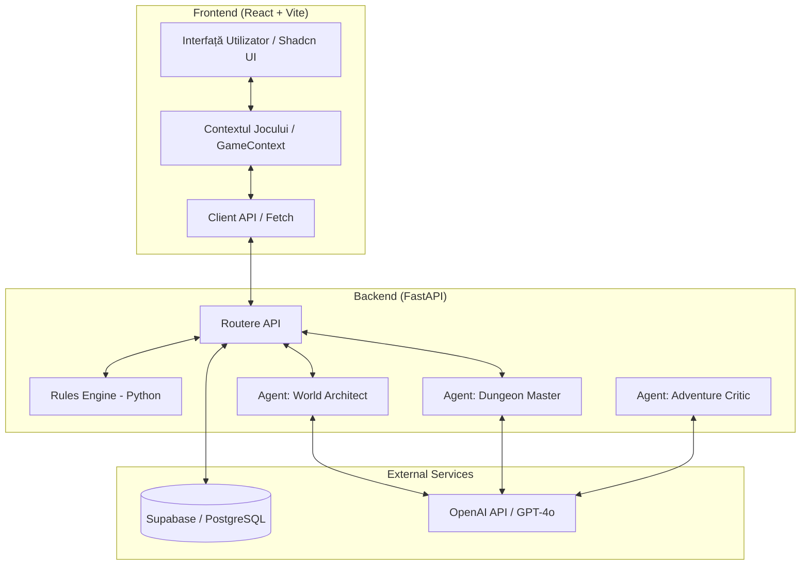
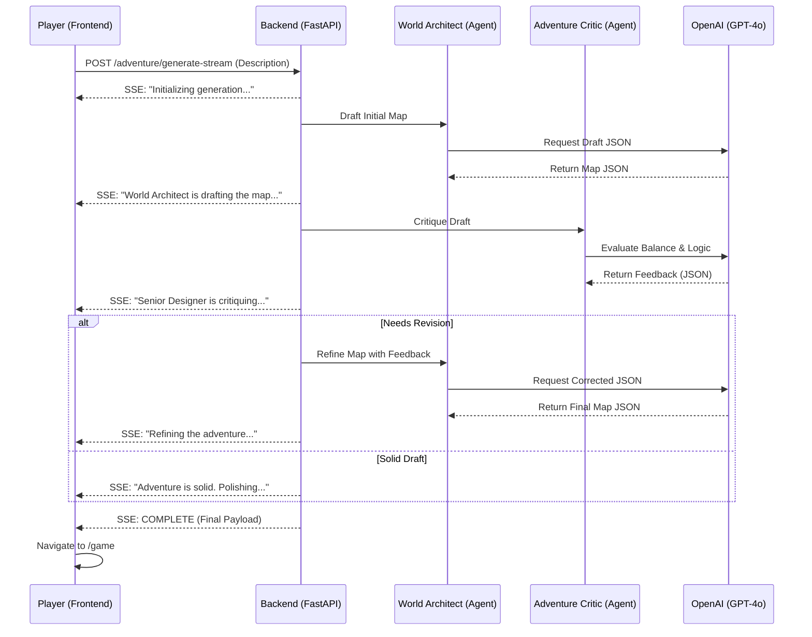
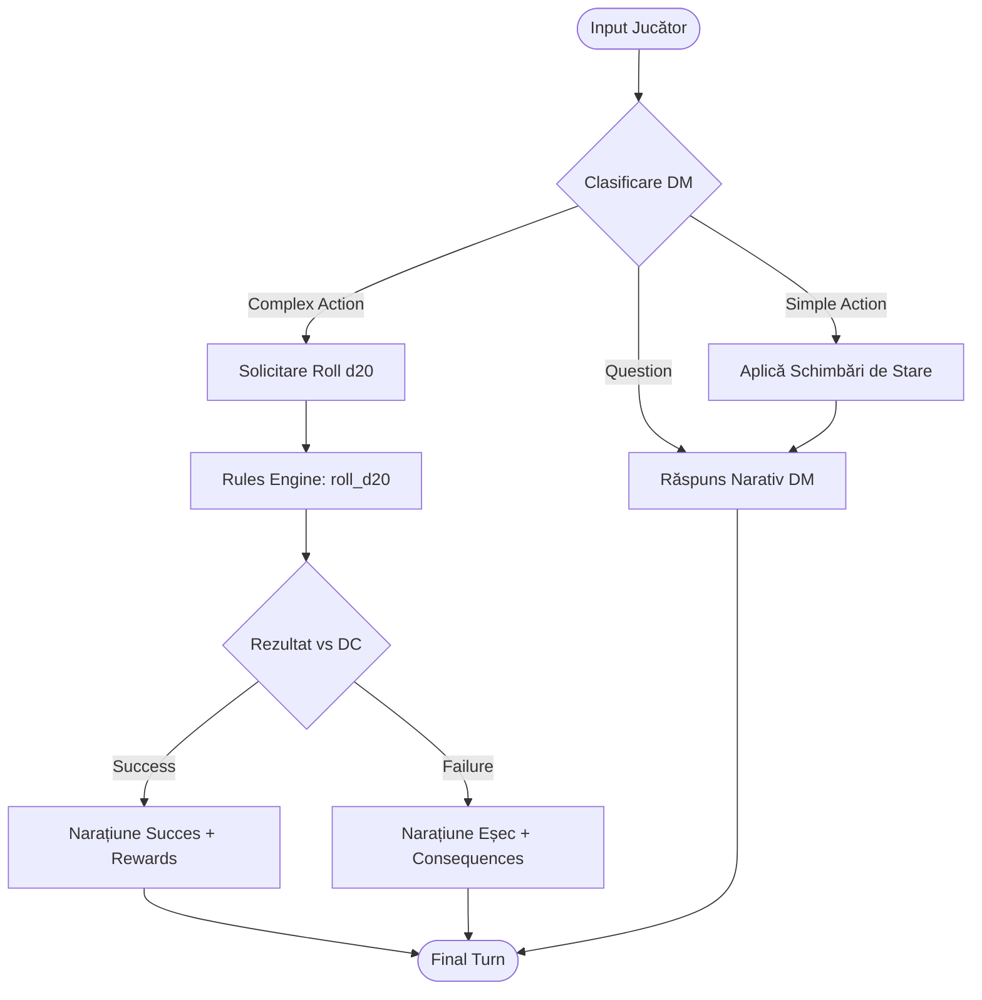
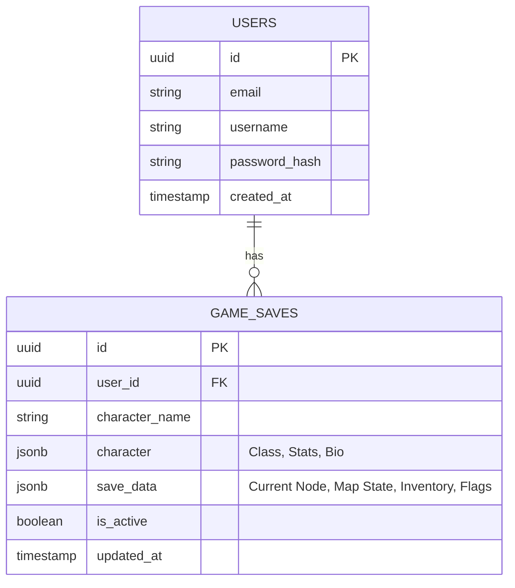

# Arhitectura Sistemului & Workflow-uri — MDS

Acest document descrie arhitectura tehnică, fluxurile de date și interacțiunile dintre agenții AI pentru proiectul **D&D — AI Game Master**.

---

## 1. Arhitectura de Sistem (Diagramă de Componente)

Sistemul urmează o arhitectură **Client-Server** decuplată, utilizând servicii cloud pentru persistență și inteligență artificială.

---

## 2. Workflow: Generare Aventură (Multi-Agent Streaming)

Procesul de generare a unei aventuri noi folosește un flux de tip **pipeline streaming**, unde mai mulți agenți colaborează pentru a asigura calitatea și echilibrul (balance) mecanic.

---

## 3. Workflow: Rezoluție Acțiune Jucător (Game Loop)

Fiecare acțiune a jucătorului este procesată printr-un sistem de clasificare pentru a determina dacă necesită un test de abilitate (dice roll) sau este o simplă interacțiune narativă.

---

## 4. Modelul de Date (ER Diagram)

Persistența datelor este gestionată prin Supabase (PostgreSQL), cu un accent pe salvarea progresului și a stării complexe a hărții în format JSONB.

---

## 5. Tehnologii Utilizate

*   **Frontend:** React 18, TypeScript, Vite, Tailwind CSS (Styling), Framer Motion (Animații), Lucide (Iconițe).
*   **Backend:** Python 3.12, FastAPI (Framework Web), Pydantic (Validare date).
*   **AI:** OpenAI SDK (Model: `gpt-4o`).
*   **Baza de date:** Supabase (Auth, RLS, PostgreSQL).
